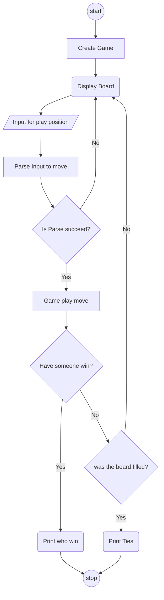

# Tic-Tac-Toe-PY

A simple tic tac toe python module for a fun game, you able to use the module for other reason, such as AI training, Bot Testing, Game Implementation, etc.

## Requirements
- Python >= 3.11
- pip

## How to run
- Open Terminal in the project folder
- Run this if you were on Linux/Mac
```bash
python -m venv venv
source venv/bin/activate
pip install -e .
python -m TicTacToePy.main
```
- Run this if you were on Window
```bash
python -m venv venv
venv\Scripts\activate
pip install -e .
python -m TicTacToePy.main
```
- the game board will appear! with `: ` as a wait of input!

## How to play
- Reccomend to use numpad to play
- use number input 1-9 as in diagram show in the program or below
```
7|8|9
4|5|6
1|2|3
```
- turn start at 0, but it wont show in the display normally, the turn is tracked in the game class.
- normal tic-tac-toe rule with Game class, 3 in a row to win. Have fun trying to win and lose! <small>or tie I don't care.</small>

## How this work?
> do not be dissapoint but I just make all of this in one shot of coffee...
### Board [board.py](./src/TicTacToePy/board.py)
Board class in board.py will handle normal board logic, hold the piece, check empty, parse data to readable, etc.
### Game [game.py](./src/TicTacToePy/game.py)
Game is the main of the project, Game will handle win/lose logic, play, print board, handle parsing player input to move, etc.
### TicTacToe Main [TicTacToe.main.py](./src/TicTacToePy/main.py)
Main will handle the game cycle for player input and validity of the move base on Game's function.
### Main Cycle
